# Mori.SkyScope

Real-time data visualization for robotics, automation and other data-heavy applications.

SkyScope draws live strip charts the way an engineering analyzer does: signals are picked up by name and dropped onto
an axis, into a lane or onto the time axis; lanes are reordered, folded and removed by their header bar; a navigator
strip shows the whole retained history with the visible window as a frame; digital signals are a logic analyzer.
Beside the trend chart it ships gauges, analytic charts and a 2D and 3D scene view for maps, lidar clouds, paths,
markers, meshes and URDF robots.

One headless core is implemented twice, in **TypeScript** and in **C#**, and the two are kept identical by a shared
fixture suite that compares layout numbers, model state and recorded drawing calls. The same chart therefore runs in
the browser through **React** or **Blazor** and on the desktop through **WPF**, fed by the same binary stream.

Apache-2.0. Copyright 2026 Cristian Mori.

---

## Contents

- [Screenshots](#screenshots)
- [What is in the box](#what-is-in-the-box)
- [Quick start](#quick-start)
- [Using the trend chart](#using-the-trend-chart)
- [Hosting it: React, Blazor, WPF](#hosting-it-react-blazor-wpf)
- [Data plane](#data-plane)
- [Sources](#sources)
- [Recording and playback](#recording-and-playback)
- [Scene views](#scene-views)
- [Gauges and analytic charts](#gauges-and-analytic-charts)
- [Architecture](#architecture)
- [Repository layout](#repository-layout)
- [Packages](#packages)
- [Building, testing, benchmarking](#building-testing-benchmarking)
- [Status and known limits](#status-and-known-limits)
- [License](#license)

---

## Screenshots

**The trend chart with the signal tree and the navigator** (React sample, `?focus=trend`). Lane header bars on the
left, signal labels inside each lane, the legend grouped by lane and by shared axis, the navigator under the time
axis with the visible window framed in red.

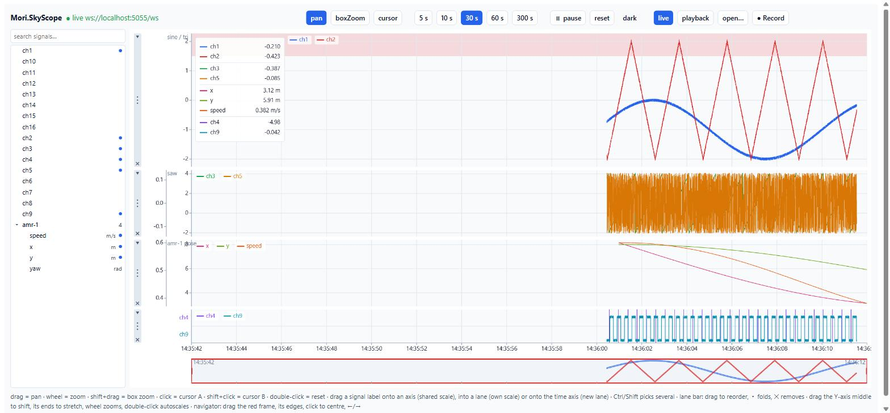

**Moving a signal.** `ch1` has been picked up by its label and is held over the Y-axis strip of the lane below. The
strip lights up, the ghost label follows the pointer, the source label is dimmed. Dropping it there puts `ch1` on
that scale.

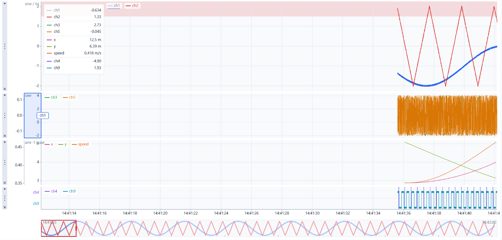

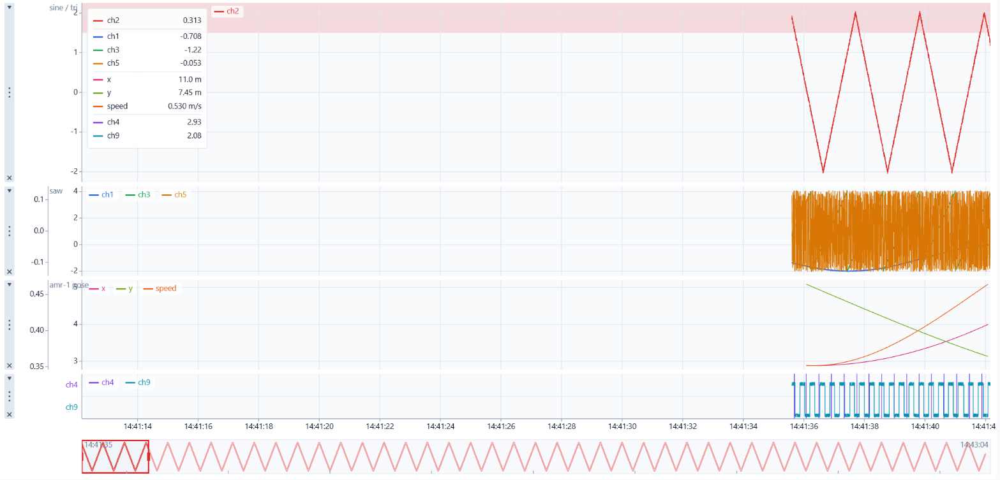

**Dragging from the signal tree.** A channel that is not in the chart yet, held over the free area of a lane. The
dashed frame means "this lane, own axis".

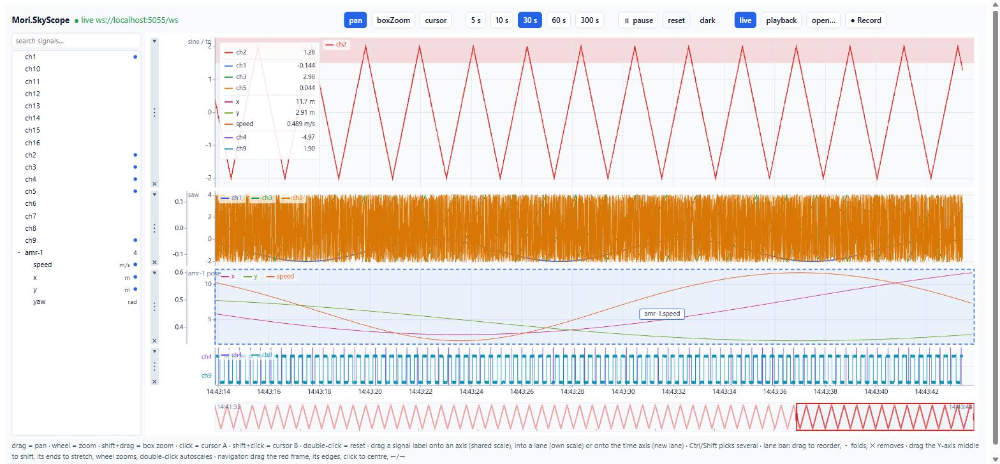

**Lanes and the navigator.** One lane folded to a summary bar, another dragged to the bottom by its header, and the
navigator frame pulled back into the history, so the chart is reviewing while the silhouette keeps growing on the
right.

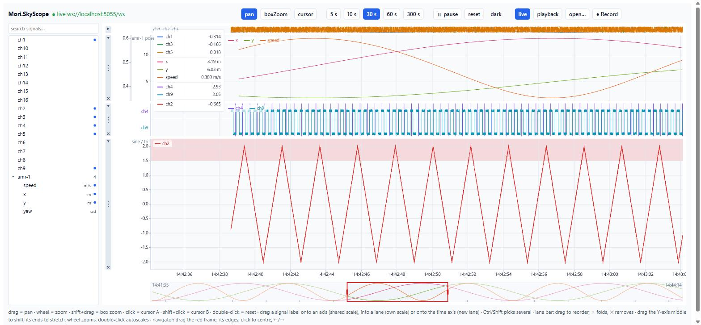

**Legend grouped by shared axis.** Signals on the same scale sit together with a bracket on the left.

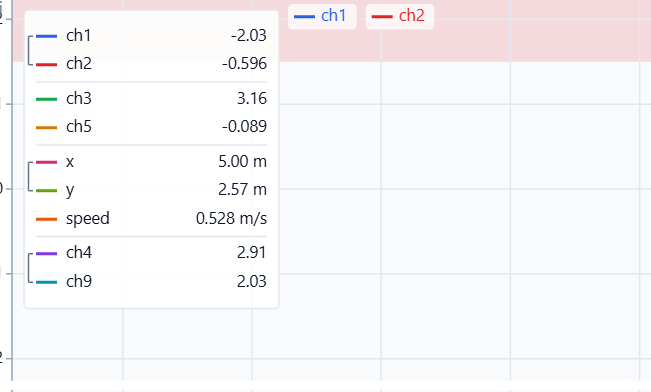

**Digital signals as a logic analyzer.** Every digital signal of a lane is a track in the lane's stack at the bottom:
solid fill while high, stepped outline, its label on its band, true or false in the legend, no Y axis.

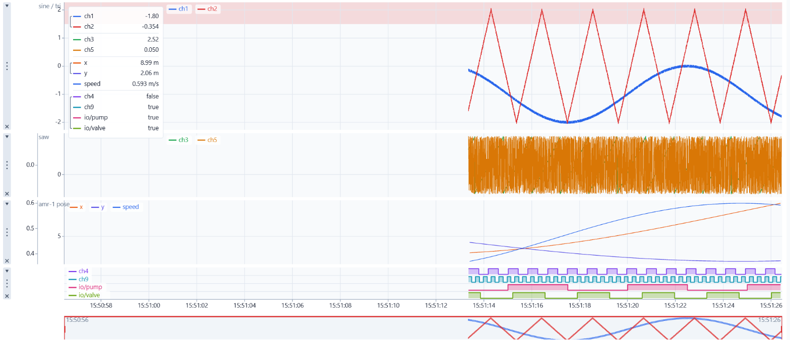

**Mixed lanes.** A digital track dropped into an analog lane gets a stack under the analog signals; an analog signal
dropped into a digital lane gets its own axis above the tracks. Analog content never crosses into a stack.

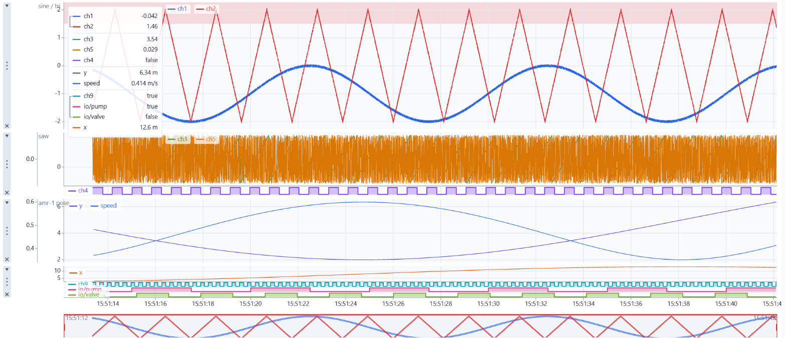

**Digital I/O from the demo server** in the signal tree and in the chart.

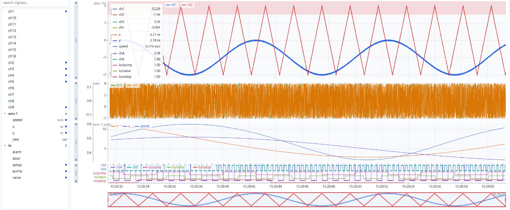

**Analytic charts, the 2D scene view, the 3D view and the WPF dashboard** (offscreen renders from the WPF sample).

| | |
|---|---|
| 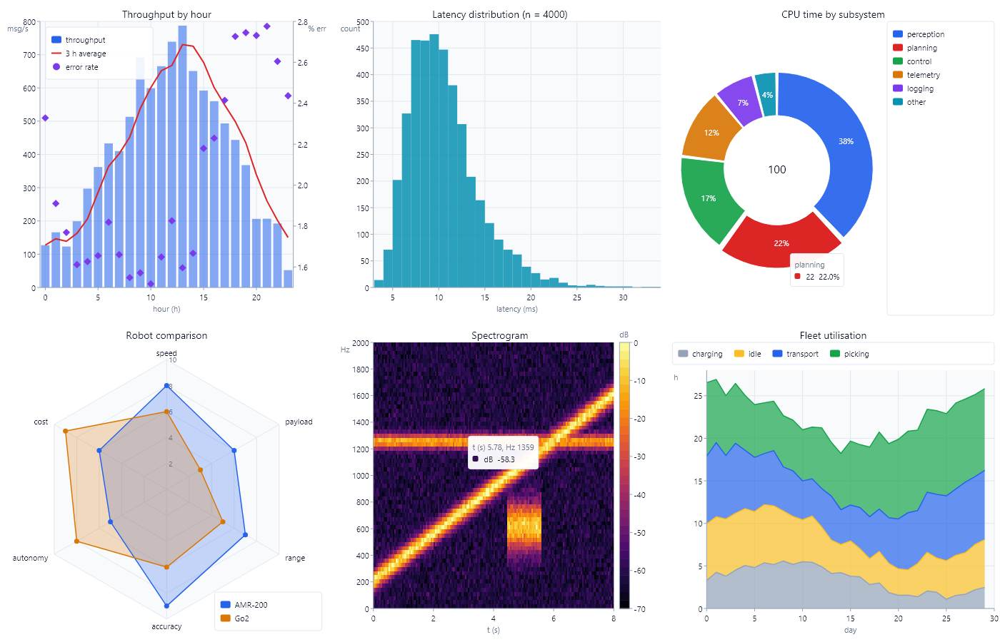 | 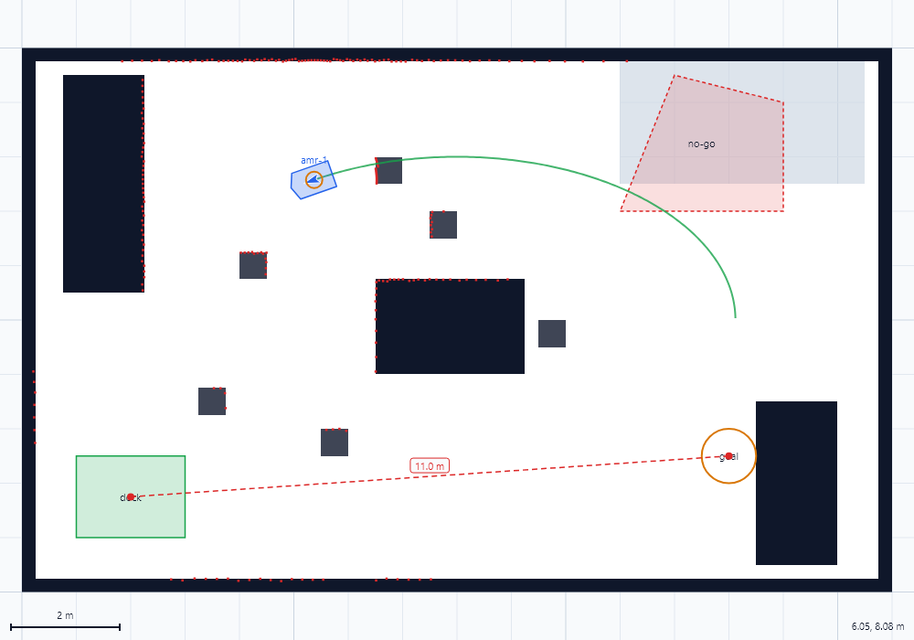 |
| 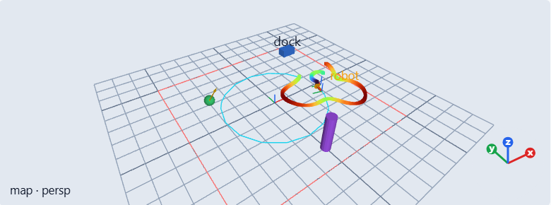 | 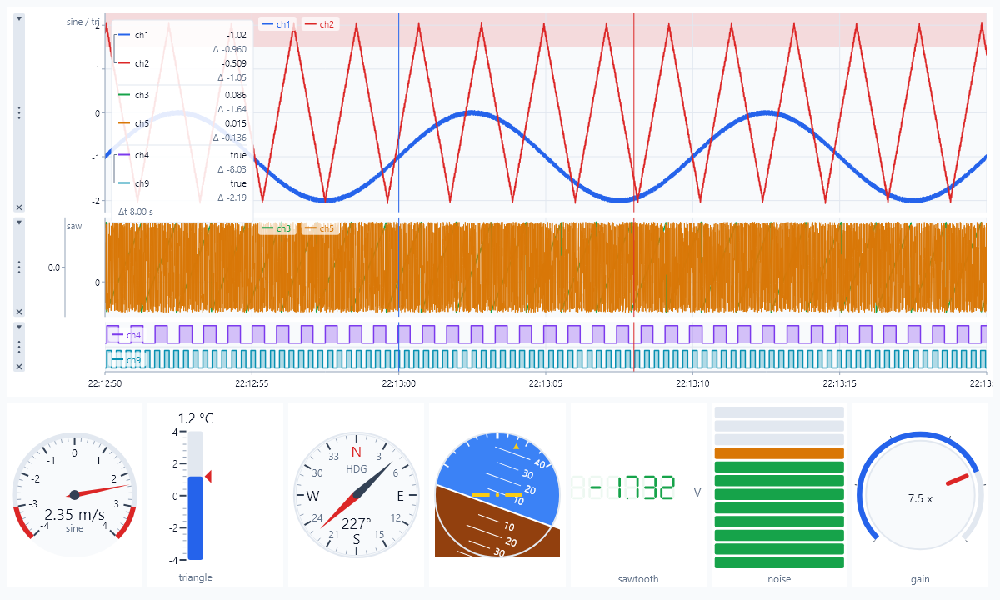 |

---

## What is in the box

### TrendChart

The flagship. A strip chart for hundreds of channels at 1 kHz with everything an analyzer user expects:

- **Lanes**: stacked strips sharing one time axis, each with a weight, several Y axes left or right, thresholds
  (bands or lines) and event markers.
- **Windows**: live (scrolling), paused, review (scrolled back in time), zoom modes, autoscale per axis.
- **Signal handling by direct manipulation**: pick a signal up by its name in the plot or in the legend and drop it
  on a Y-axis to share that scale, into a lane for a scale of its own, onto the time axis for a new lane. Ctrl or
  Shift while picking up moves several signals at once. Lane header bars reorder (drag), fold (arrow) and remove
  (cross) lanes.
- **Y-axis manipulation**: drag the middle of an axis to shift, drag its ends to stretch, wheel to zoom about the
  pointer, double-click to autoscale.
- **Navigator**: a strip under the time axis with min/max silhouettes of the whole retained history, or of the whole
  recording during playback. The visible window is a frame you move, resize, jump with a click or step with the
  arrow keys. Moving it up to "now" resumes live.
- **Signal tree**: every channel of a store grouped by name prefix (`amr-1/pose/x` → group `amr-1/pose`), with search
  over name and unit, Ctrl and Shift selection and drag into the chart.
- **Logic analyzer**: digital signals are true/false tracks in a stack at the bottom of their lane, solid-filled
  while high, never overlapping each other or the analog signals, without a Y axis. A digital-only lane is all
  stack; a mixed lane gives the stack a fixed height per track and the analog signals the rest.
- **Legend**: in any corner or as a column, grouped by lane and, inside a lane, by shared axis with a bracket; live
  values, cursor values, true/false for digital signals.
- **Cursors**: two time cursors with per-signal values, deltas and the time difference; hover readout.
- **Theme and style**: every colour in `ChartTheme`, every metric in `ChartStyle`, light and dark presets.
- **Rendering**: three passes (background, series, foreground) so WebGL can take the series pass in the browser;
  SkiaSharp on the desktop.

### Gauges

Radial, linear, LED and LED arrays, seven-segment numeric display, compass, attitude indicator. Inputs: knob,
switch, slider. Needle damping with a settle threshold, so a gauge only redraws while it moves.

### Analytic charts

Line, step, scatter, area, grouped and stacked bars, histogram, pie and donut, polar and radar, heatmap and rolling
spectrogram. Category, linear and log axes, a second Y axis, legend toggles, hover tooltips, box and wheel zoom.

### SceneView (2D)

Occupancy grids, lidar point clouds, poses with footprints, trails, bitmaps with affine placement, zones, shapes and
labels on one pan/zoom/rotate canvas, with measure and select tools and a scale bar.

### Scene3DView

A 3D viewport in the style of a robotics visualizer: point clouds, laser scans, a frame tree with timed transforms,
paths, poses, markers (cube, sphere, cylinder, arrow, lines, points, text), occupancy grids as textured planes, STL
and glTF meshes, robots from URDF with joints driven by joint states. Orbit, pan and dolly camera, perspective or
orthographic, measure and select tools. WebGL2 in the browser, OpenGL through OpenTK on the desktop, from one core.

### Data plane

`SkyScopeFrame` binary batches over WebSocket (regular-rate, timestamped or quantized channels), ring buffers sized
from rate and retention, incremental min/max decimation at the pixel quantum, a server-side broadcaster that also
relays scene layers as binary `SkyScopeLayer` messages.

### Recording and playback

Every stream can be recorded to MCAP (signals, channel catalog and scene layers) from the browser, from .NET or on
the demo server, and played back into the charts and scene views with a scrubber. Seeking replays exactly what was
on screen at that moment.

### Sources

WebSocket stream, CSV and MCAP playback, MQTT, ROS 2 through
[Mori.Ros2Sharp](https://github.com/CristianMori/Mori.Ros2Sharp), synthetic 2D and 3D scenes for demos, and a
template for your own. See [docs/PLUGINS.md](docs/PLUGINS.md).

---

## Quick start

Prerequisites: Node 24 and the .NET 10 SDK. Windows is needed only for the WPF projects.

```bash
npm install
npm run build                                  # tokens, TypeScript packages, Blazor bundle
dotnet build dotnet/Mori.SkyScope.slnx

# 1. the demo server: synthetic channels at 1 kHz, five digital I/O channels, a synthetic 2D and 3D robot scene
dotnet run --project samples/Mori.SkyScope.DemoServer -- --channels 16 --rate 1000

# 2. any of the dashboards
npm run sample                                 # React  → http://localhost:5173  (add ?focus=trend for tree + chart only)
dotnet run --project samples/Mori.SkyScope.Blazor.Sample
dotnet run --project samples/Mori.SkyScope.Wpf.Sample -- --ws ws://localhost:5055/ws
```

Demo server options: `--channels N`, `--rate Hz`, `--batch-ms ms`, `--seed n`, `--quantized true`, `--scene3d false`,
`--record out.mcap`, `--urls http://0.0.0.0:5055` to listen on every interface. `GET /` prints the stream status,
`GET /channels` the channel catalog, `GET /record`, `POST /record/start?path=…` and `POST /record/stop` control
recording remotely.

In the React sample: `?ws=ws://host:port/ws` points at another server, `?mcap=<url>` opens a served recording in
playback mode, **open…** opens a local `.mcap` or `.csv`, **Record** records what is on screen.

Offscreen renders without a window: `Mori.SkyScope.Wpf.Sample.exe --snapshot out.png`, `--logic out.png`,
`--charts out.png`, `--scene out.png` (`--dark`, `--width`, `--height`).

---

## Using the trend chart

The gestures, as the samples wire them:

| Where | Gesture | Effect |
|---|---|---|
| Plot | drag | pan in time (pauses the chart) |
| Plot | wheel | zoom time about the pointer |
| Plot | Shift + drag | box zoom (time and the lane's axes) |
| Plot | click / Shift + click | cursor A / cursor B |
| Plot | double-click | reset to live, autoscale |
| Signal label or legend row | drag onto a Y-axis strip | join that axis (shared scale) |
| Signal label or legend row | drag into a lane's free area | that lane, own axis |
| Signal label or legend row | drag onto the time axis, a gap or above the first lane | new lane there |
| Signal label or legend row | Ctrl / Shift + pick up | add to the selection; the next drag moves the selection |
| Digital signal | drag anywhere inside a lane | that lane's logic stack |
| Analog signal | drag onto a digital track or its label | that lane, own axis above the stack |
| Lane header | drag | reorder lanes (a frame marks the slot) |
| Lane header | arrow / cross | fold / remove the lane |
| Y-axis strip | drag the middle | shift the range |
| Y-axis strip | drag the top or bottom fifth | stretch about the other end |
| Y-axis strip | wheel / double-click | zoom about the pointer / autoscale |
| Navigator | drag inside the frame / drag an edge | move / resize the window |
| Navigator | click outside the frame / ← → | centre there / step by a tenth |
| Signal tree | drag a row (or a Ctrl / Shift selection) into the chart | adds the channels, same drop rules |
| Signal tree | double-click a row | adds the channel to the first lane |
| Anywhere | Esc | cancel the drag, clear the selection |

Everything above is model state. The model exposes `hitTest(layout, x, y)` → `HitRegion`, `dropTarget(…)` →
`DropTarget`, and commands such as `beginDrag`, `applyGroupDrop`, `moveLane`, `setLaneCollapsed`, `beginAxisDrag`,
`axisZoomAt`, `axisAutoscale`, `beginNavigatorDrag`, `navigatorKey`; every host (web view, WPF control) routes
its pointer events through the same calls, and the fixtures pin their results in both languages. A host that wants
to persist an arrangement serialises the chart config after `onConfigChanged` (`ConfigChanged` in WPF).

### Configuration

```ts
const config: TrendChartOptions = {
  timeSpan: 30, timeFormat: "utc", theme: LIGHT_THEME,
  legend: "top-left", plotLabels: true, laneHeaders: true, navigator: true,
  lanes: [{ id: "analog", weight: 2 }, { id: "robot" }, { id: "io", weight: 0.5 }],
  axes: [{ id: "axis:analog", label: "sine / tri" }, { id: "axis:robot", label: "pose", unit: "m" }],
  series: [
    { id: "s1", channelId: 1, laneId: "analog" }, { id: "s2", channelId: 2, laneId: "analog" },
    { id: "px", channelId: 100, laneId: "robot", name: "x" }, { id: "pv", channelId: 103, laneId: "robot", name: "speed", axisId: "speed" },
    { id: "pump", channelId: 200, laneId: "io", kind: "digital" }, { id: "valve", channelId: 201, laneId: "io", kind: "digital" },
  ],
  thresholds: [{ id: "hi", axisId: "axis:analog", from: 1.5, to: 3, color: "#dc2626", label: "high" }],
};
```

The C# configuration is the same shape (`TrendChartConfig`, `LaneConfig`, `AxisConfig`, `SeriesConfig`,
`ThresholdConfig`, `MarkerConfig`); Blazor serialises it to the JSON the TypeScript engine reads. Notable fields:
`digitalTrackHeight` and `digitalStackShare` size the logic stack in mixed lanes, `navigatorHeight` and
`navigatorFixedRange` shape the navigator, `laneHeaderWidth` and `collapsedLaneHeight` the header bars,
`style.digitalFillOpacity` the track fill.

---

## Hosting it: React, Blazor, WPF

### React

```tsx
import { SignalTree, TrendChart, useSignalStore, useWebSocketSource } from "@mori/skyscope-react";
import type { TrendChartView } from "@mori/skyscope-render";

function Dashboard() {
  const store = useSignalStore({ retentionSeconds: 600 });
  const { connected } = useWebSocketSource(store, { url: "ws://localhost:5055/ws" });
  const [view, setView] = useState<TrendChartView | null>(null);
  return (
    <div style={{ display: "grid", gridTemplateColumns: "220px 1fr", height: "100%" }}>
      <SignalTree store={store} chart={view} />
      <TrendChart store={store} config={config} tool="pan" onReady={setView} />
    </div>
  );
}
```

Data never passes through React props: the socket writes into the store, the view reads the store on its own
render loop. `onReady` hands you the view for pause, resume, reset, time span, and `view.model` for everything else.
Other components: `RadialGaugeView`, `LinearGaugeView`, `LedArrayView`, `NumericDisplayView`, `CompassView`,
`AttitudeView`, `KnobView`, `SwitchView`, `SliderView`, `XYChart`, `PieChartView`, `PolarChartView`, `HeatmapView`,
`SceneView`, `Scene3DView`, `PlaybackControls` with `usePlayback`, `RecordButton` with `useRecorder`.

### Blazor

```razor
<SignalTree WsUrl="@DataUrl" Chart="_chart" />
<TrendChart @ref="_chart" WsUrl="@DataUrl" Config="_config" Tool="_tool" Height="100%" />
<Gauge Kind="radial" Value="@speed" Options="@(new { min = -4, max = 4, unit = "m/s" })" />
<SceneView3D WsUrl="@DataUrl" Tool="orbit" Height="100%" />
```

The Razor components are control plane only: configuration crosses the interop boundary as JSON, samples stream
straight from the WebSocket into the browser. Charts on one page that share a URL share one socket. The bundled
engine ships in the package as `_content/Mori.SkyScope.Blazor/skyscope.js`.

### WPF

```xml
<sky:SignalTreeControl x:Name="Tree" />
<sky:TrendChartControl x:Name="Chart" />
<sky:GaugeControl x:Name="Speed" />
<sky:SceneControl3D x:Name="Map3D" Animate="True" />
```

```csharp
Chart.Configure(cfg);                       // TrendChartConfig
Tree.Chart = Chart;                         // the tree drags channels into this chart
var ws = new WebSocketFrameSource();
ws.StartAsync(new SourceContext(Chart.Store, layers, Chart.Clock, log),
              new WebSocketSourceConfig(new Uri("ws://localhost:5055/ws")) { Dispatch = a => Dispatcher.BeginInvoke(a) });
```

`TrendChartControl` paints with SkiaSharp on a 30 fps dispatcher timer, routes mouse, wheel and keys through the
same hit test as the web view and raises `ConfigChanged` after a gesture changed the arrangement. `SceneControl3D`
draws through OpenTK with a Skia HUD on top.

---

## Data plane

**SkyScopeFrame** is the wire format for signals:

```
header       u32 magic "SKSF" · u16 version · u32 seq · f64 t0 · u16 channelCount
per channel  u16 id · u32 count · u8 encoding
  enc 0      f64 timestamps[count] · f32 values[count]          irregular or event signals
  enc 1      f64 tStart · f64 dt · f32 values[count]            regular rate, implicit time
  enc 2      f64 tStart · f64 dt · f32 scale · f32 offset · i16 values[count]   quantized
```

Frames carry 10–50 ms of samples per channel. The encoder and decoder exist in both languages and are proven
against golden files in `spec/frames` in both directions. 500 channels at 1 kHz are about 2 MB/s as f32, half of
that quantized.

**Ingest**: a `SignalStore` holds one ring buffer per channel sized from the declared rate and the retention; a
`BucketSeries` keeps incremental min/max/first/last buckets at the chart's pixel quantum and rebuilds on zoom, so
the render loop reads at most four vertices per pixel column per channel. Pausing stops the window; ingest
continues. In the browser the socket can run in a Web Worker and transfer frames zero-copy.

**Scene layers** travel on the same socket: declarations as JSON, payloads with typed arrays (point clouds, meshes)
as binary `SkyScopeLayer` messages. Declarations may carry state (static transforms, marker sets) and are replayed
to late joiners and written first into recordings.

**Server side**: `Mori.SkyScope.Streaming` provides `FrameBroadcaster` (a signal sink and a layer sink with bounded
per-client queues and drop accounting) and `app.MapSkyScopeStream("/ws", broadcaster)` for ASP.NET Core.

---

## Sources

Everything that produces data is a source plugin against one contract (`Source`, `SourceFactory`,
`SignalSink`, `LayerSink`, `TimeSource`), identical in both languages:

| Source | TypeScript | C# |
|---|---|---|
| WebSocket stream (`SkyScopeFrame` + layers) | `@mori/skyscope-sources` | `Mori.SkyScope.Core` |
| Synthetic signals (sine, square, triangle, sawtooth, ramp, noise; analog or digital) | `@mori/skyscope-sources` | `Mori.SkyScope.Core` |
| CSV playback with a scrubber | core | core |
| MCAP playback (signals, catalog, layers) | core | core |
| MQTT (topic filters, JSON paths, timestamps, scaling) | `@mori/skyscope-sources` (mqtt.js over WebSocket) | `Mori.SkyScope.Sources.Mqtt` (MQTTnet) |
| ROS 2 (scalars, Twist, Imu, JointState, LaserScan, Odometry, OccupancyGrid, PointCloud2, TF, MarkerArray, Path, URDF robots) | — | `Mori.SkyScope.Sources.Ros2` on Mori.Ros2Sharp |
| Synthetic 2D robot scene and 3D scene with a two-joint arm | — | core |
| Template to copy | `@mori/skyscope-source-template` | `Mori.SkyScope.Sources.Template` |

Browsers cannot open raw sockets, so desktop-side sources (ROS 2, MQTT over TCP, serial) run in a .NET process and
are relayed through the broadcaster to every web client. [docs/PLUGINS.md](docs/PLUGINS.md) walks through writing
one in either language, testing it against a store with a manual clock, and shipping 3D layers and URDF robots.

---

## Recording and playback

An `McapRecorder` sits between a source and the sinks, forwards everything, and between `start()` and `stop()` writes
an MCAP file with the frames, the channel catalog and every layer message (binary payloads on a second channel of
the same `/layers/<id>` topic). The file plays back through `PlaybackSource` with play, pause, speed, seek and loop
over a manual clock; seeking backwards resets the sinks and replays, so charts and scenes show exactly what was on
screen at that time. Playback hosts set the navigator's range to the recording's span. Uncompressed and lz4 chunks are
read; zstd is not yet.

Record from the React, Blazor or WPF dashboards, from any .NET process, or on the demo server (`--record`, or the
`/record` endpoints while it runs).

---

## Scene views

**SceneView (2D)** layers: `BitmapLayer` (affine placement, ROS map origin convention), `OccupancyGridLayer`,
`PointCloudLayer` with `laserScanToPoints`, `PoseLayer` (heading, footprint, label), `ShapeLayer`, `TrailLayer`,
`GridLayer`. Controller: pan, wheel zoom, Shift-drag box zoom, measure, select, Q/E rotate, R reset, F fit, scale bar,
cursor readout.

**Scene3DView** layers: `grid3d`, `axes`, `pointCloud3d`, `laserScan3d`, `path3d`, `pose3d`, `markers`,
`occupancyGrid3d`, `frames`, `meshes`. Every layer takes a frame and an optional stamp and is placed through a
tf-style `FrameTree` into the fixed frame. Markers may reference STL or glTF (.glb) meshes by URI; `publishUrdf`
turns a URDF into a marker set plus joint transforms you drive from joint states. Controller: left drag orbits,
middle or Shift drag pans, right drag or wheel dollies, double-click fits, F fit, R reset, T top-down, O orthographic,
measure and select with a gizmo and cursor readout. Lines wider than one device pixel are drawn as instanced
screen-space quads. The WebGL2 and OpenGL painters share their shader bodies.

---

## Gauges and analytic charts

Gauges share a `GaugeTheme`, 1-2-5 scale ticks, bands and exponential damping; the compass damps across the 0/360
seam. The analytic charts share axes, legend, tooltip and markers: `CartesianChart` (line, step, scatter, area, bars
grouped or stacked with sign-aware stacking, category/linear/log axes, second Y axis), `Histogram` (1-2-5 bin
widths, density option), `PieChart` (donut, pad angle, labels, hover explode), `PolarChart` (polar or radar, circle
or polygon grid), `Heatmap` (seven named colour maps or custom stops, colour bar, rolling spectrogram through
`pushColumn`). Each exists in both languages and is pinned by its fixture, including drawing-parity cases.

---

## Architecture

```
spec/fixtures/*.json · spec/frames/*.bin · spec/meshes · spec/mcap     shared truth, run by BOTH cores
design/tokens → CSS variables, TS constants, C# constants               one token source

TypeScript                                   C#
@mori/skyscope-core      headless engine     Mori.SkyScope.Core          headless engine
@mori/skyscope-render    Canvas2D, WebGL,    Mori.SkyScope.Render.Skia   SkiaSharp painter
                         WebGL2 3D, views    Mori.SkyScope.Render.OpenTK OpenGL 3D painter
@mori/skyscope-react     React components    Mori.SkyScope.Wpf           WPF controls
@mori/skyscope-blazor    JS bridge (bundled) Mori.SkyScope.Blazor        Razor components + bundle
@mori/skyscope-sources   WebSocket, MQTT,    Mori.SkyScope.Streaming     broadcaster, ASP.NET endpoint
                         synthetic           Mori.SkyScope.Sources.*     Mqtt, Ros2, Template
```

- **The core emits geometry.** Charts, gauges and scene layers are plain models with a `draw(painter, …)` and pointer
  methods. A `Painter` contract of about fifteen primitives (line, polyline, polygon, rect, circle, arc, sector, text,
  measureText, image, clip, transform, layer cache) is implemented by Canvas2D, WebGL, and SkiaSharp; a `Painter3D`
  (points, lines, triangles, textured quad, versioned mesh buffers) by WebGL2 and OpenTK.
- **Two implementations, one behaviour.** Every module has a fixture driver in both languages. A fixture is
  `create(setup) → step… → snapshot`; expectations are generated by the TypeScript driver and the C# driver must
  reproduce them, numbers to nine decimals. Drawing-parity cases record every painter call with its resolved style
  and compare the two cores op for op. Layout uses a painter-free text width estimate so both cores place labels
  identically without a font engine.
- **Hosts are thin.** The web view owns three canvases (2D background, WebGL series, 2D foreground), a resize
  observer and a render loop; the WPF control owns a Skia surface and a timer. Both route input through the model's
  hit test and commands, and both can be driven from outside (a signal tree drops channels through
  `externalDragStart/Move/Drop`).
- **Data never crosses a framework boundary.** Sources write into a store; views read it on their own schedule.
  Blazor and React only carry configuration.

---

## Repository layout

```
ts/packages/        core, render, react, blazor (bridge), sources, tokens, source-template
dotnet/             Mori.SkyScope.Core (+ .Tests), Render.Skia, Render.OpenTK, Wpf, Blazor, Streaming,
                    Sources.Mqtt, Sources.Ros2, Sources.Template; Mori.SkyScope.slnx
spec/               fixtures (32 files), golden frames, meshes, an MCAP sample
design/             tokens and the shared stylesheet
samples/            DemoServer, react-sample, Mori.SkyScope.Blazor.Sample, Mori.SkyScope.Wpf.Sample
tools/              build-design, gen-frames, gen-demo-csv, pack-npm, bench-ingest
docs/               COMPONENTS.md (every component with its files and fixture), PLUGINS.md, PLAN.md, STATUS.md,
                    screenshots/, images/
.github/workflows/  ci.yml
```

---

## Packages

| npm | NuGet |
|---|---|
| `@mori/skyscope-core` — headless engine | `Mori.SkyScope.Core` — headless engine |
| `@mori/skyscope-render` — Canvas2D + WebGL painters, views, signal tree panel | `Mori.SkyScope.Render.Skia` — SkiaSharp painter |
| `@mori/skyscope-react` — React components and hooks | `Mori.SkyScope.Render.OpenTK` — OpenGL 3D painter |
| `@mori/skyscope-sources` — WebSocket, MQTT, synthetic sources | `Mori.SkyScope.Wpf` — WPF controls |
| `@mori/skyscope-tokens` — design tokens | `Mori.SkyScope.Blazor` — Razor components + bundled JS |
| `@mori/skyscope-source-template` — plugin starting point | `Mori.SkyScope.Streaming` — frame broadcaster, ASP.NET endpoint |
| | `Mori.SkyScope.Sources.Mqtt`, `.Sources.Ros2`, `.Sources.Template` |

`npm run pack` and `dotnet pack dotnet/Mori.SkyScope.slnx -c Release -o artifacts/nuget` produce the tarballs and
`.nupkg` files; CI uploads them as a build artifact.

---

## Building, testing, benchmarking

```bash
npm run build          # design tokens, every TypeScript package, the Blazor bundle
npm run typecheck
npm test               # Vitest: all fixtures, painters, sources, codec round-trips
dotnet build dotnet/Mori.SkyScope.slnx
dotnet test dotnet/Mori.SkyScope.Core.Tests   # xUnit: the same fixtures, golden frames, streaming, ROS 2 decoders
npm run bench -- 60    # ingest 500 channels × 1 kHz for 60 s; zero drops expected
npm run frames         # regenerate the golden binary frames from the TypeScript codec
```

The fixture suite is the contract between the two cores: when you change behaviour, change the TypeScript side,
regenerate the fixture expectations with its driver, then make the C# side reproduce them. `docs/COMPONENTS.md`
lists every component with its files and its fixture. CI (`.github/workflows/ci.yml`) runs both suites on Windows
so the WPF projects build too.

---

## Status and known limits

[docs/STATUS.md](docs/STATUS.md) is the day-by-day log; [docs/PLAN.md](docs/PLAN.md) the plan it followed.

Known limits:

- MCAP files with zstd chunks cannot be read yet (uncompressed and lz4 can); foreign CDR topics in bags are not
  decoded on playback.
- ROS 2 payloads over about 60 KB need RTPS fragmentation that Mori.Ros2Sharp does not have yet; relay large clouds
  from a machine running a full ROS 2 stack.
- glTF meshes are read from `.glb` files only (no external buffers or textures, triangles only); Collada is not read.
- The OpenGL desktop path has been exercised through its painter contract and offscreen renders; a GPU session is
  the place to judge its frame rate.
- Channels declared without a rate keep a fixed number of samples rather than a retention time, which bounds how far
  back the navigator can show for them.

---

## License

Apache-2.0. Copyright 2026 Cristian Mori. See [LICENSE](LICENSE) and [NOTICE](NOTICE).
